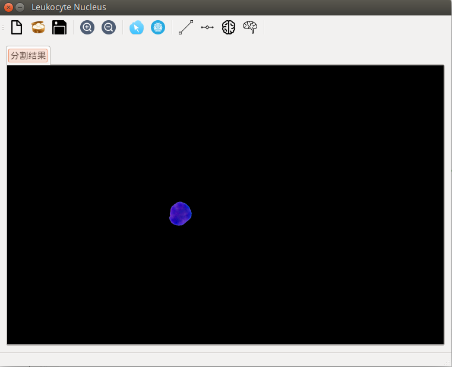
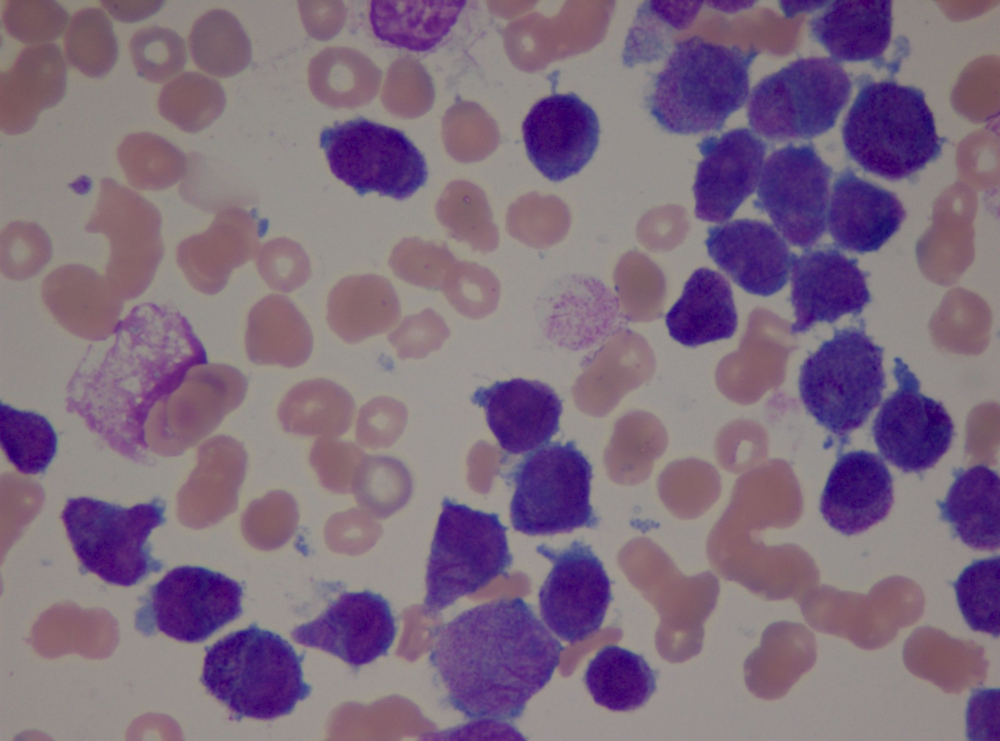

#LJ

---

##update log
changed a lot since 2015-3-16

reconstruct the classification, add ann, rewrite classification as virtual class, which derived
annpredictor and svmpredictor

add poctureSelection, no-willingly, just to compensate for the image process part

using python to debug the machine learning part
thx [scikit-learn](http://scikit-learn.org/stable/index.html) again

sth to-do:
1. make image part better
2. debug the ml part
3. the new idea, use cluster to split white cell and other things, include background and red cell

---

##summerize the work before

environment:  
* Ubuntu 14.04LTS  
* Qt Creator 3.0.1 & Qt 5.2.1 with(GCC 4.8.2, 64bit)  
* Opencv 2.4.10  

module:  
* analyse: func used for image process  
* classification: a svm classification to classify the nuclei  
* feature: extract features from nuclei for classification  
* gram_schmidt_seg: my own algorithm, use gram_schmidt method to extract nuclei from whole cell  
* main: top-level func call mainwindow  
* mainwindow: form the ui and the trigger all the process  
* nclseg: process the image to extract nuclei, use ltos of func in analyse module  
* opencv2qt: a module by Ssagtiss seem to be able to transform image from opencv to qt== haven't used it by now  
* svm: libsvm 3.20 Copyright (c) 2000-2014 Chih-Chung Chang and Chih-Jen Lin. All rights reserved.  

UI:  
  

next:  
implement ANN and code in C++ ways!  

done.

--2015-3-16-9:03 AM  

******
This program is programed in C++, which based on Qt and use opencv...

###算了还是用中文吧
这是一个从血液图片当中分割并且识别白细胞的软件，使用我略显捉急的C++（基本上都是C）来编写，用Qt完成图形界面设计（基本没有）， 加上opencv来实现图像处理。

闲着没事干，觉得老自己看书没什么用，于是找老师做项目，帮助老师带的一个学姐将她的算法实现。
一开始看算法框图（暂时不放上来了）觉得好难，稍微做出来一点之后觉得也不是很难，现在再做下去就觉得很坑了！
###因为她使用matlab实现的！很多matlab的函数超级好用！看她演示的时候我就惊呆了啊！人家一条语句实现的东西我自己用opencv得寻死觅活写个几十行才能实现啊！！！

目前做了很捉急。

接下来还得学学Qt，学学C++，然后看看支持向量机（把细胞分割这一块做出来就要开始识别了）。
当成一个日志报告来写吧这个readme。。。

最后，上图，最难**的一张图==

